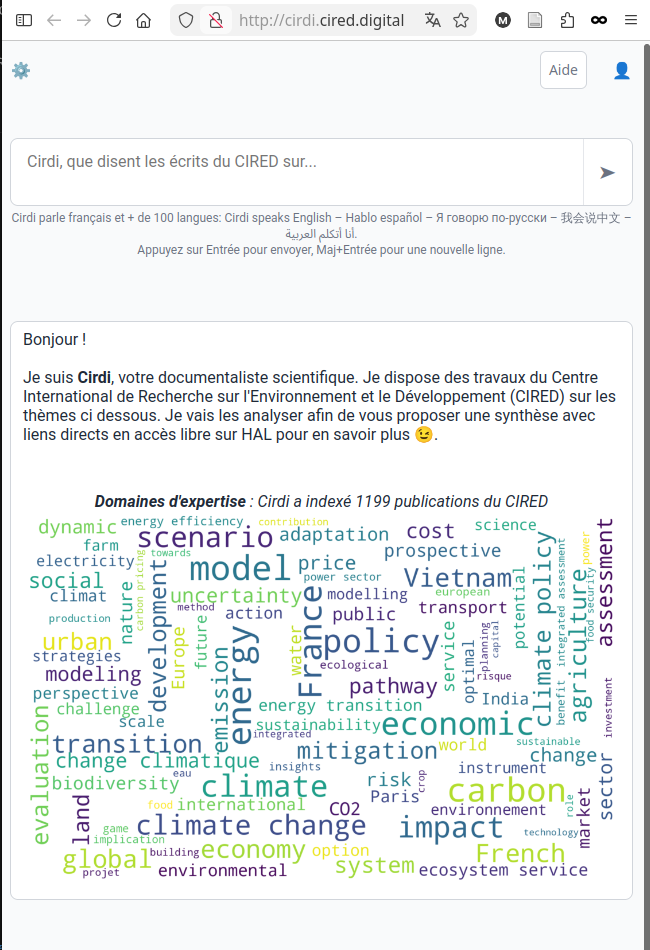
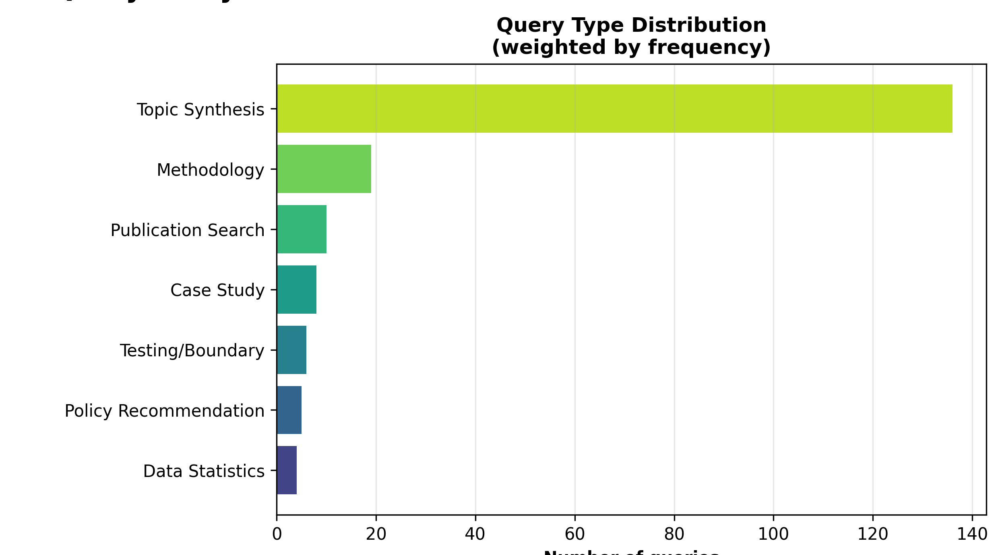
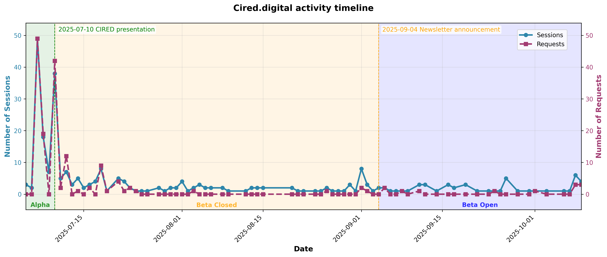
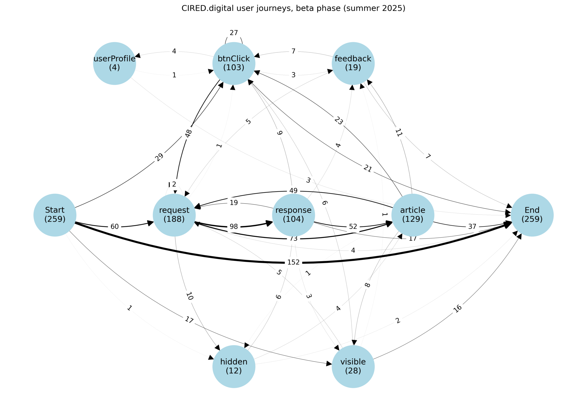

## Plan

\tableofcontents

# 1 — Cirdi : une question, une réponse sourcée

## Cirdi, en direct

::::: {.columns}
:::: {.column width="54%"}

::::
:::: {.column width="42%"}
\vspace{0.8em}

**1199 publications** du CIRED indexées.

Une question en langage naturel --- une **réponse synthétique et sourcée** dans HAL.

\medskip
Accès **lexical** : \url{https://hal.science/CIRED}

\smallskip
Accès **sémantique** : \url{http://cired.digital/}
::::
:::::

::: {.notes}
Démo LIVE (secours = cette capture). Poser UNE question précise sur une publi CIRED,
montrer la réponse ET les sources HAL citées. 90 secondes.
Le reste = « voici la méthode, et ce qu'elle vaut ».
:::

# 2 — HAL en lexical, Cirdi en sémantique : même corpus

## Mots-clés, ou langage naturel ?

::::: {.columns}
:::: {.column width="48%"}
**Accès lexical --- c'est déjà HAL**
(mots-clés, booléen, textométrie)

- Il faut *connaître* les bons termes
- Rend une **liste de documents**
- Précis, transparent, reproductible
- Rate ce qui est dit *autrement*
::::
:::: {.column width="48%"}
**Accès sémantique --- c'est Cirdi**
(question en langage naturel, RAG)

- Tolère l'imprécision de la formulation
- Rend une **réponse synthétique**
- Agrège plusieurs sources, cite
- Rate... et peut inventer
::::
:::::

\begin{center}
\small Deux moteurs d'accès au \emph{même} corpus. Comprendre le RAG, c'est voir HAL --- en sémantique.
\end{center}

::: {.notes}
C'est LE cadrage pour ce public de fouille de texte : positionner le RAG comme
un mode d'accès complémentaire, pas un remplaçant. Assumer le « invente » d'emblée.
:::

# 3 — Le RAG : découper, plonger, récupérer, générer

## Qu'est-ce que le RAG ?

\textbf{R}etrieval-\textbf{A}ugmented \textbf{G}eneration : au lieu de répondre « de mémoire », le modèle **va d'abord chercher** dans le corpus, puis rédige à partir de ce qu'il a trouvé.

\vspace{0.6em}
\begin{center}
\begin{tikzpicture}[font=\scriptsize,
  b/.style={draw, rounded corners, minimum width=17mm, minimum height=7mm, align=center},
  s/.style={draw, rounded corners, minimum width=17mm, minimum height=7mm, align=center, fill=black!6}]
  \node[s] (corpus) at (0,1.15) {Corpus\\HAL};
  \node[b] (chunk)  at (2.4,1.15) {Découpage};
  \node[b] (embed)  at (4.8,1.15) {Plongement};
  \node[s] (index)  at (7.3,1.15) {Index\\vectoriel};
  \draw[->] (corpus)--(chunk);
  \draw[->] (chunk)--(embed);
  \draw[->] (embed)--(index);
  \node[s] (q)   at (0,0)   {Question};
  \node[b] (ret) at (2.4,0) {Récupération};
  \node[b] (gen) at (4.8,0) {Génération};
  \node[s] (ans) at (7.3,0) {Réponse\\sourcée};
  \draw[->] (q)--(ret);
  \draw[->] (index)--(ret);
  \draw[->] (ret)--(gen);
  \draw[->] (gen)--(ans);
\end{tikzpicture}
\end{center}

\small Le corpus vient de HAL ; Cirdi ajoute cet accès --- **open source**, réplicable sur toute collection HAL.

## Les concepts clés

\small

**Découpage (chunking)** --- ici, délégué au moteur (**R2R**) : découpage **par longueur** (segments de taille fixe, avec chevauchement).

\smallskip
**Plongement (embedding)** --- projeter chaque passage, et la question, en vecteur. Proximité des vecteurs $\approx$ proximité de sens.

\smallskip
**Récupération (retrieval)** --- ramener les passages les plus proches de la question. **Dense** : proximité des plongements (le sens). **BM25** : recouvrement de mots-clés (le score lexical des moteurs de recherche classiques). Ici, recherche **mixte** = les deux combinées.

\smallskip
**Génération** --- le LLM rédige une réponse **ancrée** dans ces passages, et **cite** ses sources.

::: {.notes}
Une slide sur l'architecture, pas plus. Insister sur « ancrée » et « citation » :
c'est ce qui distingue d'un chatbot généraliste.
:::

# 4 — Corpus et découpage sont des choix de méthode

## Nos choix --- et ce qu'on aurait pu faire de plus

\begin{center}
\small
\begin{tabular}{@{}lP{3.2cm}P{5.4cm}@{}}
\toprule
\textbf{Dimension} & \textbf{Notre choix} & \textbf{Aller plus loin / mieux} \\
\midrule
Corpus            & HAL, texte intégral & + archives, + revues sous péage \\
Découpage         & longueur fixe       & découpage structuré (sections) \\
Hébergement       & commercial          & Huma-Num, ou interne au labo \\
Suivi des usages  & RGPD prudent        & opt-in, ou activé par défaut \\
\bottomrule
\end{tabular}
\end{center}

\small Des choix volontairement **prudents et minimaux** --- assumés, et extensibles.

::: {.notes}
Retour d'expérience honnête : chaque ligne est un choix de méthode, pas un détail
technique. On a systématiquement pris l'option conservatrice ; la colonne de droite
dit où l'on gagnerait en couverture, en qualité, ou en richesse des données.
:::

# 5 — Exemples d'usage

## Types de requêtes : la synthèse thématique domine

::::: {.columns}
:::: {.column width="54%"}

::::
:::: {.column width="42%"}
\vspace{0.8em}

Les questions posées se rangent en catégories :

- **Synthèse thématique** --- la plus fréquente, de loin
- Recherche de publication
- Question de méthode
- Étude de cas, test de limites, recommandation…

\medskip
On vient surtout **faire le point sur un sujet**, pas seulement retrouver un document.
::::
:::::

::: {.notes}
Montrer un exemple réel en live si possible. Le point clé : la traçabilité rend
la synthèse vérifiable — sans elle, ce serait inutilisable en recherche.
:::

# 6 — Un RAG ne garantit ni exactitude ni reproductibilité

## Ce qu'un RAG ne garantit pas

- **Hallucination bornée, pas nulle** --- l'ancrage réduit sans supprimer
- **Biais de couverture** --- seul existe ce qui est dans HAL, en texte intégral
- **Dépendance** aux embeddings et au découpage --- deux réglages, deux résultats
- **Non-reproductibilité du modèle** --- même question, réponse variable
- **Évaluation difficile** --- jeu de questions test + évaluateur automatique de la chaîne

::: {.notes}
Public SHS = valorise la lucidité méthodologique. Ne pas survendre. La ligne
« évaluation difficile » ouvre naturellement sur la discussion.
:::

# 7 — Un dispositif réel, et mesuré : usages et coûts

## Usages et coûts, en bref

::::: {.columns}
:::: {.column width="58%"}

::::
:::: {.column width="40%"}
\vspace{0.4em}

- Dispositif **instrumenté** : événements anonymisés, rapport reproductible
- Coûts **étonnamment bas** à cette échelle :
  \medskip

  \begin{center}
  \textbf{1,71 M tokens Mistral $\;\to\;$ 0,32 €}
  \end{center}
::::
:::::

\begin{center}
\small Détails chiffrés en annexe.
\end{center}

::: {.notes}
Bloc court : prouver que c'est un dispositif réel, mesuré, pas une maquette.
Renvoyer les curieux vers les annexes coûts.
:::

# 8 — Le pas suivant : l'accès sémantique dans HAL

## Une méthode, et le code

- **Réutilisable** : chaîne RAG + instrumentation RGPD + rapport Quarto reproductible
- **Réplicable** : Cirdi tourne sur n'importe quelle collection HAL
- Code ouvert : \texttt{github.com/MinhHaDuong/cired.digital}

\begin{center}
\large HAL donne l'accès \emph{lexical}. Le pas suivant :\\
\textbf{y intégrer l'accès sémantique}.

\medskip
Merci --- questions ?
\end{center}

::: {.notes}
Fermer sur la méthode et l'ouverture SHS, pas sur l'outil.
:::

```{=latex}
\appendix
```

# Annexes

## Coûts mesurés --- volumes et facture

Mesure empirique (factures / tableaux de bord fournisseurs), mi-2025 :

| Fournisseur | Tokens        | Période   | Coût facturé            |
|-------------|--------------:|-----------|-------------------------|
| OpenAI      | ~25,1 M       | juin–oct  | projet, non nul         |
| Mistral     | 1,71 M        | juin–nov  | **0,32 €**              |

\medskip

Record de frugalité : **1,3 M tokens pour 0,23 €** (Mistral, juillet).
Plusieurs mois : usage non nul, **coût facturé nul** (seuils / crédits fournisseurs).

::: {.notes}
Le « coût nul malgré usage » est un piège méthodologique : la facture réelle est
dominée par des seuils, pas par le tarif au token.
:::

## Coûts --- ce qu'on en apprend

1. **Coûts très bas** à petite/moyenne échelle --- factures dominées par seuils et crédits
2. **L'input domine** --- ratios entrée/sortie de 6:1 à 10:1
3. **Le volume prime sur le choix de modèle** --- l'usage se concentre sur les petits modèles ; les gros restent marginaux
4. **Le tarif catalogue prédit mal le coût réel** --- seule la mesure empirique est crédible

::: {.notes}
Message pour un décideur : ne pas extrapoler depuis les prix affichés. Mesurer.
:::

## Usage OpenAI par modèle (juin–oct 2025)

| Modèle         | Requêtes | Tokens entrée | Tokens sortie |
|----------------|---------:|--------------:|--------------:|
| o4-mini        |      761 |    11,8 M     |     1,08 M    |
| gpt-4.1-mini   |      797 |     7,74 M    |     0,24 M    |
| gpt-4o-mini    |      667 |     1,72 M    |     0,14 M    |
| gpt-4.1-nano   |      510 |     1,53 M    |     0,03 M    |
| gpt-4.1        |      561 |     0,53 M    |     0,06 M    |

\medskip
Forte concentration en **juin** ; l'usage de juillet chute de **deux ordres de grandeur**.

## Coûts Mistral --- usage quotidien (juillet)

\begin{center}
\includegraphics[width=0.82\linewidth]{slides-assets/july_mistral_small_euros.png}
\end{center}

\small Coût journalier en euros --- `mistral-small-latest` (> 90 % des tokens). Pic à ~0,03 €/jour.

## Comment on interroge --- parcours d'usage

::::: {.columns}
:::: {.column width="52%"}

::::
:::: {.column width="44%"}
\vspace{0.5em}

Transitions entre événements (`request`, `response`, `feedback`) :
une **grammaire d'usage** --- poser, relancer, abandonner.
::::
:::::

## Qui vient --- origine des visiteurs

\begin{center}
\includegraphics[height=0.74\textheight]{slides-assets/visitors_origin.png}
\end{center}

## Évaluer la chaîne RAG

- **Jeu de questions test** construit depuis les questions fréquentes du site du labo
- **Évaluateur automatique** de réponses
- **Évaluateur global** de la chaîne RAG (récupération + génération)
- Observabilité : scores, analyse fine des questions posées

::: {.notes}
L'évaluation reste le maillon faible et ouvert — bon point d'entrée pour la discussion
avec un public de méthodologues.
:::

## Livrables du projet

- **L1** --- Code source documenté, open source (GitHub)
- **L2** --- Rapport méthodologique (choix techniques, éthiques)
- **L3** --- Jeu de données d'interactions **anonymisées**, entrepôt ouvert
- **L4** --- Rapport d'analyse des usages (performances, coûts € et CO₂)

## Instrumentation & RGPD

- Événements captés : `request`, `response`, `feedback`, `visibilityChange`
- **Anonymisation dès la collecte** : hash de session, pas d'identifiant, minimisation
- Rétention limitée, finalité déclarée (étude des usages)
- Le journal anonymisé est le **matériau d'enquête** --- et il est déposé (L3)

::: {.notes}
Mesurer l'usage sans surveiller l'usager : le compromis que ce public discutera.
:::
